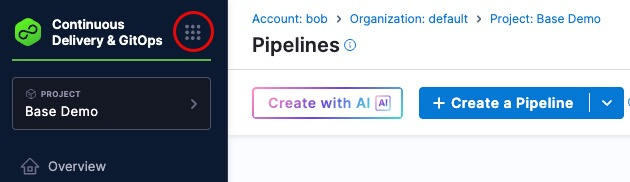
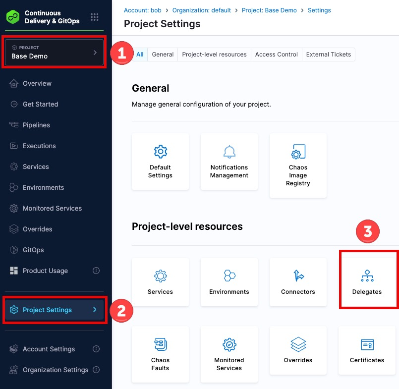
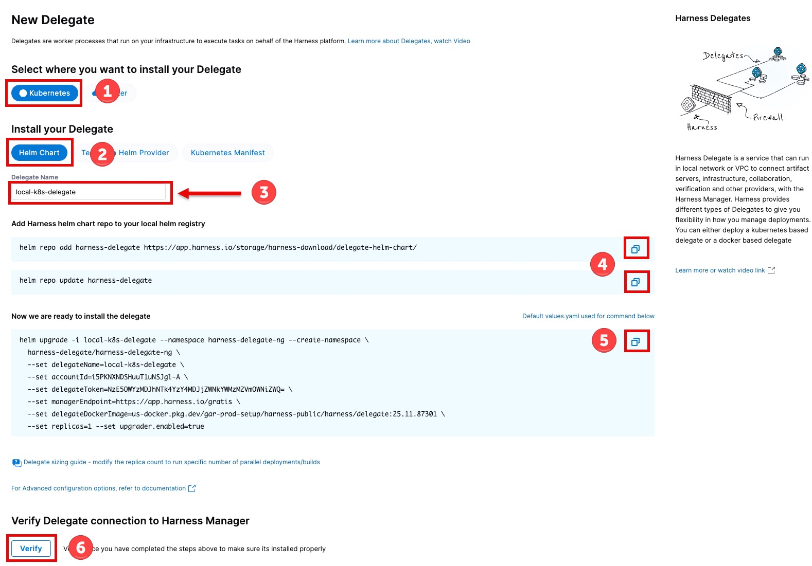

# Lab 0: Getting Started

> **Lab Type**: BASE DEMO - Available with free Harness account

## About This Partner Demo Kit

This **Partner Demo Kit** includes two parts: 

1. **Base Demo** (Labs 1-4, 6) - Covers core Harness capabilities:
   - Code Repository with Secret Scanning
   - CI Pipeline with Test Intelligence
   - Continuous Deployment (Rolling and Canary strategies)
   - Continuous Verification with Prometheus

2. **Advanced Demo** (Labs 5, 7) - Extends the base kit with licensed features:
   - Security Testing Orchestration (STO)
   - Software Supply Chain Assurance (SSCA)
   - OPA Policy Enforcement
   - Advanced governance capabilities

> **Note**: The advanced features (Labs 5 and 7) require licenses for the STO and SCS modules in Harness. Please contact your Harness Partner Account Manager for more information. The base demo can be completed with a free Harness account.

## Overview

This guide helps you get started with the Harness Partner Demo Kit. The setup process is automated through a script that handles all infrastructure and Harness resource provisioning. You'll then install a Harness delegate before proceeding with the individual labs.

## Prerequisites

Before starting, ensure you have:

1. **Harness Account**
   - Free (or paid) Harness account with CI, CD, and Code Repository modules
   - Harness Account ID (found in your account profile URL)
   - Harness Personal Access Token (PAT) with appropriate permissions

2. **Local Environment**
   - Docker Engine running
   - Kubernetes cluster: Colima (macOS Apple Silicon), minikube, Docker Desktop, or Rancher Desktop
   - Terraform installed
   - kubectl and helm installed
   - Git client installed

3. **Docker Hub Account**
   - Docker Hub account created
   - Docker Hub repository `harness-demo` created
   - Docker Hub Personal Access Token (PAT) generated

## Run the Automated Setup

The demo includes an automated setup script that handles all infrastructure and resource provisioning:

**1. Make the script executable (first time only):**
```bash
chmod +x start-demo.sh
```

**2. Run the setup script:**
```bash
./start-demo.sh
```

The script will prompt you for:
- Harness Account ID
- Harness Personal Access Token (PAT)
- Docker Hub username and password

> **Tip**: The script saves your configuration to `.demo-config` for future runs, so you won't need to re-enter credentials.

**3. Wait for completion:**
The script may take several minutes to complete depending on the machine being used. Watch for the success message indicating all resources were created.

## What the Setup Script Did

The automated setup configured your complete demo environment:

1. **Detected and Started Kubernetes** - Identified your cluster (Colima, minikube, Docker Desktop, or Rancher Desktop) and ensured it's running
2. **Deployed Prometheus** - Installed Prometheus in the `monitoring` namespace for continuous verification
3. **Built and Pushed Docker Images** - Created the backend application, testing, and docs Docker images and pushed them to your Docker Hub
4. **Provisioned Harness Resources** - Used Terraform to create the "Base Demo" project with all connectors, environments, services, pipelines, and monitored services
5. **Saved Your Configuration** - Stored credentials in `.demo-config` for subsequent runs

## Access the Demo Documentation

The setup script deployed this documentation to your local Kubernetes cluster for easy access during the demo:

1. **Open the documentation** in your browser:
   ```
   http://localhost:30001
   ```

2. **Set up side-by-side viewing** for the best demo experience:

   **Option A: Two Browser Windows**
   - Open the documentation in one browser window: `http://localhost:30001`
   - Open Harness in another window: `https://app.harness.io`
   - Arrange them side-by-side on your screen

   **Option B: Chrome Split-View Tabs** (Chrome 135+)
   - Open both URLs in Chrome tabs
   - Right-click on either tab and select **"Move tab to new window with side-by-side"**
   - This creates a split-view within a single Chrome window for convenient navigation

> **Tip**: Having the documentation and Harness UI visible simultaneously makes it much easier to follow along with the labs step-by-step.

## Access Your Harness Account

Now that setup is complete, access your Harness account to verify resources:

1. Navigate to [app.harness.io](https://app.harness.io)
2. Log in with your Harness credentials
3. **Select the "Base Demo" project** from the project picker in the top navigation

> **Important**: All lab activities take place in the **"Base Demo"** project. This keeps demo resources separate from production environments.

## Verify Your Setup

Before installing the delegate, verify that Terraform created all required resources:

### Harness Resources in "Base Demo" Project

Navigate to the **"Base Demo"** project and verify:

**Code Repository:**
- Using the module selection button 
- Choose the **Code Repository** module
- Verify `partner_demo_kit` repository exists

**Continuous Delivery & Git Ops**
- Next, using the module selection button again, choose the **Continuous Delivery & Git Ops** module
- If the setup wizard dialog launches, you can simple **X** out of it at the upper-right corner

**Connectors:**
- On the left-side menu, go to **Project Settings** > **Connectors**
- Verify these connectors exist:
  - `workshopdocker` - Docker Hub connector
    - Should show Success
  - `workshop_k8s` - Kubernetes connector (for local cluster)
    - Will show "Failed" for now as we haven't installed a delegate yet
  - Prometheus connector (for continuous verification)
    - Will show "Failed" for now as we haven't installed a delegate yet

**Environments:**
- Go to **Environments**
- Verify `Dev` environment exists
- Click into Dev environment and verify `K8s Dev` infrastructure definition exists

**Services:**
- Go to **Services**
- Verify `backend` service exists and is configured with K8s manifests

**Templates:**
- Go to **Templates** (under Project Settings)
- Verify `Compile Application` step template exists

**Monitored Services:**
- Go to **Monitored Services**
- Verify `backend_dev` monitored service exists for continuous verification

### Local Infrastructure

Verify your local infrastructure is running:

**Kubernetes Cluster:**
```bash
kubectl cluster-info
# Should show Kubernetes control plane running
```

**Prometheus:**
```bash
kubectl get pods -n monitoring
# Should see prometheus-k8s-0 pod running
```

## Install Harness Delegate

The Harness Delegate is required to execute pipelines and connect to your local Kubernetes cluster. Install it at the **project level** using Helm:

### 1. Navigate to Delegate Installation

1. In the Harness UI, make sure your **Base Demo** project is selected in the scope box.
2. Select **Project Settings** on the left menu
3. Click **Delegates**
   

4. Click **Install a Delegate** (or **New Delegate** if you have existing delegates)

### 2. Configure Delegate Settings

> **Important**: Copy the exact command from the Harness UI as it includes your account-specific details.

1. **Select delegate type**: Choose **Kubernetes**
2. **Select installation method**: Choose **Helm Chart**
3. **Name your delegate**: It must be `local-k8s-delegate` for the pre-created connectors to work.
4. **Copy and paste**: the 2 lines to add the chart repo to the local helm registry in your terminal.
5. **Copy and paste**: directions in your local terminal (where your k8s cluster is running) to install the delegate
6. After a minute or so, click **Verify**



7. Click **Done** once verified.

### 3. Verify Delegate Installation

**Check delegate pod status:**
```bash
kubectl get pods -n harness-delegate-ng

# Wait for pod to show STATUS: Running (may take 1-2 minutes)
```

**Verify delegate is connected in Harness UI:**
1. Stay on the Delegates page in Harness
2. Wait for your delegate to appear in the delegates list (refresh if needed)
3. Status should show **Connected** with a green indicator

> **Note**: If the delegate doesn't connect within 2-3 minutes, check the pod logs: `kubectl logs -n harness-delegate-ng <pod-name>`

### 5. Verify Delegate Functionality

Test that the delegate can access your local Kubernetes cluster:

1. Go to **Project Settings** > **Connectors** in the "Base Demo" project
2. Click on the `workshop_k8s` connector
3. Click **Test Connection** (top right)
4. Repeat steps 1-3 for the `prometheus` connector
5. The tests should succeed, confirming the delegate can communicate from your local cluster to Harness

## Troubleshooting

### Setup Script Failed

**If start-demo.sh fails during execution:**
1. Check the error message for specific issues
2. Verify all prerequisites are installed:
   ```bash
   docker --version
   kubectl version --client
   terraform --version
   helm version
   ```
3. Ensure Docker Engine is running
4. Verify Kubernetes cluster is accessible: `kubectl cluster-info`
5. Re-run the script after fixing issues: `./start-demo.sh`

### Can't Find "Base Demo" Project

1. Check if Terraform completed successfully in the script output
2. Verify the project exists: Harness UI > **Projects** > Look for "Base Demo"
3. If missing, re-run setup: `./start-demo.sh`

### Delegate Not Connecting

**Check delegate pod status:**
```bash
kubectl get pods -n harness-delegate-ng
kubectl logs -n harness-delegate-ng <pod-name>
```

**Common issues:**
- Pod is not running: Check for image pull errors or resource constraints
- Delegate shows in UI but status is "Not Connected": Check network connectivity
- Delegate token expired: Generate a new token and reinstall

### Kubernetes Cluster Issues

**Rancher Desktop:**
- Verify Rancher Desktop is running
- Check Kubernetes is enabled in **Preferences** > **Kubernetes**
- Restart Rancher Desktop if needed

**Minikube:**
- Start cluster: `minikube start`
- Check status: `minikube status`
- If tunnel needed: Run `minikube tunnel` in a separate terminal

### Prometheus Not Running

```bash
# Check Prometheus pod
kubectl get pods -n monitoring

# If not running, redeploy
kubectl create namespace monitoring
kubectl -n monitoring apply -f ./kit/prometheus.yml
```

### Connector Test Failures

**workshop_k8s connector fails:**
- Verify delegate is connected
- Check delegate has access to your local cluster
- Test manually: `kubectl get nodes`

**workshop-docker connector fails:**
- Verify Docker Hub credentials in Harness secrets
- Test manually: `docker login`
- Ensure Docker Hub repository `harness-demo` exists

## Lab Structure

Now that you've completed the setup and installed the delegate, you're ready to proceed with the demo labs:

1. **Lab 1: Code Repository Secret Scanning** - Prevent secrets from being committed to your code repository
2. **Lab 2: CI Pipeline** - Build application with test intelligence and push Docker images
3. **Lab 3: Frontend Deployment** - Deploy frontend using rolling deployment strategy
4. **Lab 4: Backend Deployment** - Deploy backend using canary deployment strategy
5. **Lab 5: Security Testing** - Advanced security scanning (requires licensed partner org)
6. **Lab 6: Continuous Verification** - ML-powered deployment validation with Prometheus
7. **Lab 7: OPA Policy Enforcement** - Policy-as-code governance (requires licensed partner org)

> **Note**: Labs 5 and 7 require a licensed Harness organization. The core demo (Labs 1-4, 6) can be completed with a free Harness account.

## Important Notes

**Before Starting Lab 1:**
- Ensure your delegate shows **Connected** status in Harness
- Verify all connectors in the "Base Demo" project test successfully
- If using minikube, keep `minikube tunnel` running in a separate terminal throughout the demo
- Colima, Rancher Desktop, and Docker Desktop users don't need a tunnel - services are automatically accessible

**Throughout the Demo:**
- All activities take place in the **"Base Demo"** project
- The `partner_demo_kit` repository in Harness Code Repository is mirrored from GitHub
- You'll generate Git credentials for the Harness Code Repository in Lab 1
- Your local Kubernetes cluster and Prometheus must remain running

**Next Steps:**
Proceed to **Lab 1: Code Repository Secret Scanning** to begin the demo!

---

