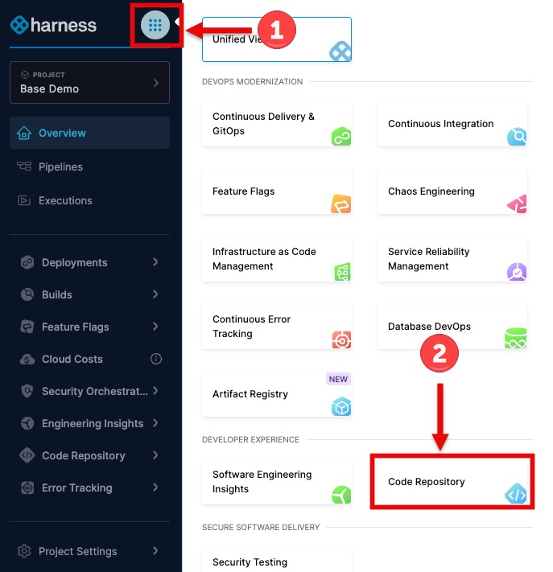
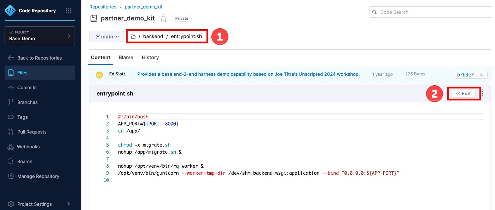
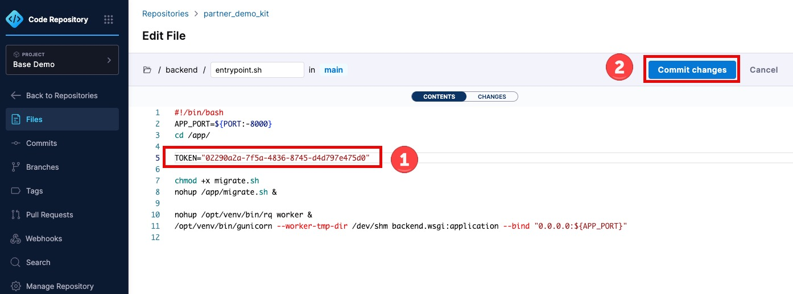

# Lab 1: Code Repository Secret Scanning

> **Lab Type**: BASE DEMO - Available with free Harness account

## Overview
This lab demonstrates Harness Code Repository's secret scanning feature, which prevents sensitive data (like API tokens, passwords, and keys) from being committed to your repository.

## Prerequisites
- Terraform setup completed (creates "Base Demo" project and `partner_demo_kit` repository)
- Harness account with Code Repository module enabled
- Git client installed locally

## Step 1: Navigate to Harness Code Repository

1. Log in to your Harness account at [app.harness.io](https://app.harness.io)
2. Select the **"Base Demo"** project
   

3. Click on **Code Repository** module in the left navigation

   


## Step 2: Enable Secret Scanning

1. In Harness UI, go to **Code Repository** > **Manage Repository**
2. Click on the **Security** tab
3. Toggle **"Secret Scanning"** to **ON**
4. Click **Save**

> **What Secret Scanning Detects**:
> - API keys and tokens
> - Passwords and credentials
> - Private keys and certificates
> - High-entropy strings that look like secrets
> - Cloud provider credentials (AWS, Azure, GCP)

## Step 3: Test Secret Scanning

Now let's intentionally try to commit a secret to demonstrate the blocking feature:

1. **Edit the file** `backend/entrypoint.sh`
   

2. **Add this line** anywhere in the file:
   ```bash
   TOKEN="02290a2a-7f5a-4836-8745-d4d797e475d0"
   ```
   

3. **Commit your Changes**:
   - Click `Commit changes` button 
   
## Expected Result

The push should be **BLOCKED** with an error message similar to:

```
pre-receive hook blocked reference update: "Found 1 secret(s) in your code. Push rejected."
```


> **This is Proactive Security in Action!**
> The secret was blocked BEFORE it entered the repository, preventing it from ever appearing in the Git history.

## Key Takeaways

- **Harness Code Repository** provides security features to protect your code
- **Secret scanning** prevents secrets from being pushed to repositories
- This is **proactive security** - blocking secrets before they enter your codebase
- No waiting for secrets to be committed - prevention happens at push time
- The standard Git workflow (`add`, `commit`, `push`) is enforced with security checks

## Why This Matters

Traditional secret detection tools scan after commits are made. Harness Code blocks secrets **before** they enter your repository, providing:
- Earlier detection in the development cycle
- Reduced risk of exposed credentials
- Compliance with security best practices
- Protection against accidental credential leaks
- No need to rewrite Git history to remove secrets

## Clean Up

Remove the test secret from your local file:

- Hover over the red box at the top of the page and click the red `X` to close
- Click `Cancel` to close the Commit dialog.
- Click `Cancel` again to discard our file changes.

---
