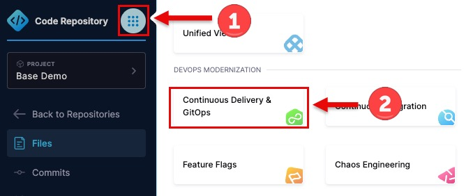

# Lab 2: CI Pipeline with Test Intelligence

> **Important**: All activities in the **"Base Demo"** project

## Overview
This lab walks through creating a complete CI pipeline with test intelligence, compilation, and Docker image building. You'll configure build infrastructure and see how Harness optimizes your CI/CD workflows.

## Prerequisites
- Harness account with CI module enabled
- "Base Demo" project created by Terraform
- Docker Hub account with `harness-demo` repository

## Step 1: Create a New Pipeline

1. In Harness UI, use the modular selector button to navigate to CD module
   
2. Close the wizard if displayed
   
3. Click **Pipelines** in the "Base Demo" project (close the wizard if displayed)
4. Click **+ Create Pipeline**
   - **Name**: `Workshop Build and Deploy`
   - **Store**: Inline (for simplicity)
5. Click **Create**

> **Note**: Inline vs. Remote - We're using inline for this lab, but you can store pipelines in Git repositories alongside your application code.

## Step 2: Add a Build Stage

1. Click **+ Add Stage**
2. Select **Build** as the stage type
3. Configure the build stage:
   - **Stage Name**: `Build`
   - **Clone Codebase**: Enable
   - **Repository Name**: `partner_demo_kit` (the Harness Code repository created by Terraform)
4. Click **Set Up Stage**

## Step 3: Configure Build Infrastructure

You have several options for build infrastructure. Choose the one that best fits your needs:

### Option A: Harness Cloud (Recommended)

> **Important**: Harness Cloud is available for verified Harness accounts. If you're using a new or free-tier account, you may need to use Option B (Kubernetes) instead.

1. On the **Infrastructure** tab
2. Select **Harness Cloud**
3. Choose the architecture that matches your development environment:
   - **arm64** - If using Apple Silicon (M1/M2/M3)
   - **amd64** - If using Intel processors
4. Click **Continue**

**Benefits of Harness Cloud**:
- Zero configuration required
- Autoscaling build environment
- Fastest bare-metal hardware available
- No infrastructure management
- Dramatically less expensive than on-premise solutions

### Option B: Kubernetes Build Farm (Alternative)

If you do not wish to use Harness Cloud, you can use your local Kubernetes cluster:

1. On the **Infrastructure** tab
2. Select **Kubernetes**
3. Configure:
   - **Connector**: `workshop_k8s` (created by Terraform)
   - **Namespace**: `harness-delegate-ng` (or your delegate namespace)
4. Click **Continue**

**Benefits of Kubernetes Build Farm**:
- Use existing Kubernetes infrastructure
- Full control over build environment
- Works with any Kubernetes cluster (minikube, Rancher Desktop, cloud providers)
- No external dependencies

> **Note**: For this demo, either option will work. Harness Cloud provides a better experience but requires account verification.

## Step 4: Add Test Intelligence Step

1. On the **Execution** tab, click **+ Add Step**
2. Select **Add Step** > **Test Intelligence**
3. Configure:
   - **Name**: `Test Intelligence`
   - **Command**:
     ```bash
     cd ./python-tests
     pytest
     ```
4. Click **Apply Changes**

> **Understanding Test Intelligence**:
>
> **The Problem**: Traditional CI systems run your entire test suite on every commit, even when only a small part of the codebase changed. This leads to:
> - Wasted time waiting for irrelevant tests to run
> - Higher infrastructure costs
> - Slower developer feedback loops
> - Reduced productivity
>
> **The Solution**: Test Intelligence uses ML to analyze:
> - Code changes in your commit
> - Historical test results and failures
> - Code coverage data
> - Dependencies between code and tests
>
> **The Result**: Test Intelligence automatically selects only the tests that are relevant to your changes:
> - **80% faster** test execution on average
> - **Same confidence** - catches the same bugs as running all tests
> - **Automatic** - no configuration or test tagging required
> - **Learns over time** - gets smarter with each run
>
> **How It Works in This Demo**:
> - **First run**: Runs all tests to establish a baseline
> - **Subsequent runs**: Only runs tests affected by code changes
> - **Example**: If you only change `backend/views.py`, it won't run frontend tests
>
> This is particularly powerful for large codebases with thousands of tests where a typical commit only affects a small subset.

> **Note**: While this demo uses a small test suite (so you won't see dramatic time savings), the same technology scales to save hours on enterprise test suites.

## Step 5: Add Compile Step (Using Template)

1. Click **+ Add Step**
2. Select **Use Template**
3. Select the **"Compile Application"** template (created by Terraform)
4. Configure:
   - **Name**: `Compile`
5. Click **Apply Changes**

> **About Templates**:
> This step uses a pre-configured template created by Terraform. Templates allow platform teams to standardize build processes across the organization, ensuring consistency and best practices.
>
> The "Compile Application" template:
> - Installs Node.js dependencies
> - Builds the Angular frontend application
> - Produces production-ready static assets

## Step 6: Add Docker Build and Push Step

1. Click **+ Add Step**
2. Select **Add Step** > **Build and Push an image to Docker Registry**
3. Configure:
   - **Name**: `Push to Dockerhub`
   - **Docker Connector**: `workshop-docker` (created by Terraform)
   - **Docker Repository**: `dockerhubaccountid/harness-demo`
     - ⚠️ Replace `dockerhubaccountid` with YOUR Docker Hub username
   - **Tags**: Click **+ Add**
     - Add: `demo-base-<+pipeline.sequenceId>`
     - Change field type to **Expression** using the icon
   - **Optional Configuration** (expand):
     - **Dockerfile**: `/harness/frontend-app/harness-webapp/Dockerfile`
     - **Context**: `/harness/frontend-app/harness-webapp`
4. Click **Apply Changes**

> **Expression Syntax**: `<+pipeline.sequenceId>` is a Harness expression that provides the pipeline execution number. This ensures each build creates a uniquely tagged Docker image.

## Step 7: (Optional) Enable Cache Intelligence

If you're using **Harness Cloud** for builds, you can enable Cache Intelligence to speed up subsequent builds:

1. Return to the **Build** stage **Infrastructure** tab
2. In the Harness Cloud configuration, expand **Advanced**
3. Toggle **Enable Cache Intelligence** to ON
4. Click **Apply Changes**

> **What is Cache Intelligence?**
> Cache Intelligence automatically caches build dependencies and artifacts between pipeline runs:
> - Speeds up builds by 40-60% on average
> - No configuration required - works automatically
> - Caches Docker layers, package manager dependencies, and build artifacts
> - Only available with Harness Cloud

## Step 8: Save and Run the Pipeline

1. Click **Save** in the top right
2. Click **Run**
3. Select **Branch**: `main`
4. Click **Run Pipeline**

## Monitor the Execution

Watch the pipeline execute:
- ✅ **Test Intelligence** - Runs Python tests
- ✅ **Compile** - Builds the Angular frontend
- ✅ **Push to Dockerhub** - Builds and pushes the Docker image

> **First Run**: The first execution will run all tests. Subsequent runs will use Test Intelligence to run only relevant tests based on code changes.

## Verify the Results

1. **Check the pipeline execution** in Harness - all steps should be green
2. **Verify the Docker image** was pushed:
   - Visit: `https://hub.docker.com/r/dockerhubaccountid/harness-demo/tags`
   - You should see a new tag: `demo-base-1` (or higher sequence number)

## Key Takeaways

- **Multiple infrastructure options** - Choose Harness Cloud or Kubernetes based on your needs
- **Harness Cloud** requires account verification but provides the best experience
- **Test Intelligence** optimizes test execution for faster feedback
- **Templates** standardize build processes across teams
- **Docker integration** makes artifact management seamless
- **Cache Intelligence** (Harness Cloud only) dramatically speeds up builds
- **Pipeline as Code** can be stored inline or in Git

## Build Infrastructure Comparison

| Feature | Harness Cloud | Kubernetes |
|---------|---------------|------------|
| Setup Required | None | Minimal (connector) |
| Account Requirements | Verified account | Any account |
| Performance | Fastest (bare-metal) | Depends on cluster |
| Scaling | Automatic | Manual/cluster-dependent |
| Cache Intelligence | ✅ Yes | ❌ No |
| Cost | Pay-as-you-go | Use existing infrastructure |

## Pipeline Configuration Summary

Your pipeline now has these components:
- **Build** stage with:
  - Infrastructure: Harness Cloud or Kubernetes
  - Test Intelligence (pytest)
  - Compile Application (Angular build via template)
  - Docker Build & Push (to Docker Hub)
  - Cache Intelligence (optional, Harness Cloud only)

---
